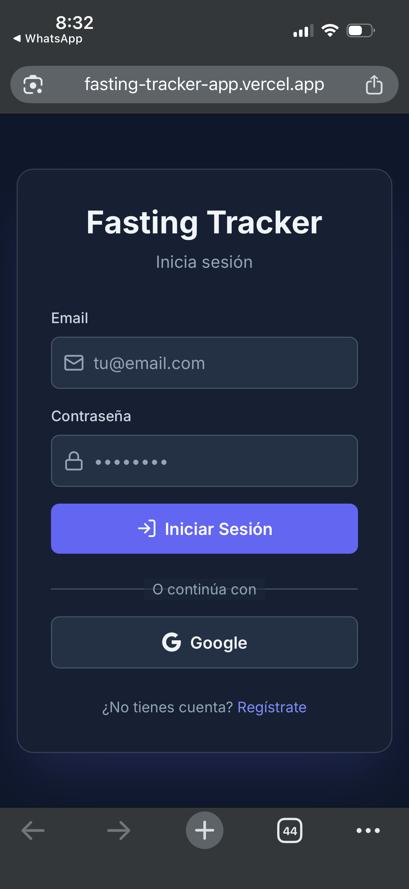
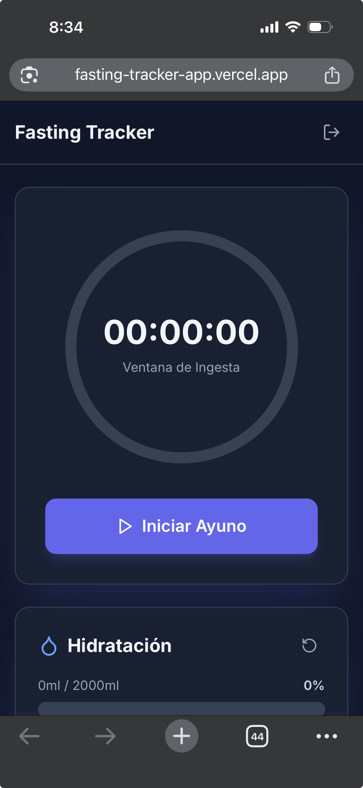
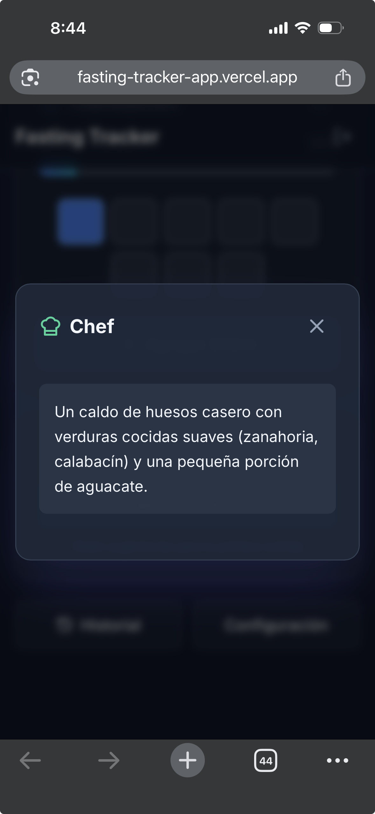

# 📸 Screenshots y Videos

Esta sección contiene capturas de pantalla y videos demostrativos de la aplicación Fasting Tracker.

## 📱 Capturas de Pantalla

### Pantalla de Login



*Pantalla de autenticación con opciones de Email/Password y Google Sign-In*

!!! note "Agregar Screenshot"
    Para agregar una captura de pantalla:
    1. Guarda la imagen en `docs/images/`
    2. Usa el formato: ``

### Temporizador Principal



*Vista principal del temporizador con anillo circular animado*

### Tracker de Hidratación


*Contador de agua con barra de progreso visual*

### Historial de Ayunos


*Panel de historial con estadísticas y sesiones pasadas*

### Asistente IA



*Modal del asistente IA con respuestas del Coach Motivacional*

## 🎥 Videos Demostrativos

### Demo Completo de la Aplicación

<iframe width="560" height="315" src="https://www.youtube.com/embed/VIDEO_ID" frameborder="0" allow="accelerometer; autoplay; clipboard-write; encrypted-media; gyroscope; picture-in-picture" allowfullscreen></iframe>

!!! note "Agregar Video"
    Para agregar un video:
    1. Sube el video a YouTube o Vimeo
    2. Reemplaza `VIDEO_ID` con el ID del video
    3. O usa el formato de embed de la plataforma

### Tutorial: Primer Uso

<iframe width="560" height="315" src="https://www.youtube.com/embed/VIDEO_ID" frameborder="0" allow="accelerometer; autoplay; clipboard-write; encrypted-media; gyroscope; picture-in-picture" allowfullscreen></iframe>

### Funcionalidades PWA

<iframe width="560" height="315" src="https://www.youtube.com/embed/VIDEO_ID" frameborder="0" allow="accelerometer; autoplay; clipboard-write; encrypted-media; gyroscope; picture-in-picture" allowfullscreen></iframe>

## 📋 Guía para Agregar Contenido

### Agregar Screenshots

1. Toma capturas de pantalla de la aplicación
2. Guárdalas en `docs/images/` con nombres descriptivos:
   - `login-screen.png`
   - `timer-screen.png`
   - `water-tracker.png`
   - `history-screen.png`
   - `settings-screen.png`
   - `ai-assistant.png`

3. Agrega las imágenes usando Markdown:
   ```markdown
   
   ```

### Agregar Videos

1. Sube el video a YouTube o Vimeo
2. Obtén el código de embed
3. Agrega el iframe en esta página

### Formatos Recomendados

- **Screenshots**: PNG o JPG, mínimo 1280px de ancho
- **Videos**: MP4, máximo 50MB, o usar YouTube/Vimeo
- **GIFs**: Para demostraciones cortas de animaciones

## 🎨 Capturas por Funcionalidad

### Autenticación

!!! todo "Pendiente"
    Agregar screenshots de:
    - Pantalla de login
    - Registro de usuario
    - Login con Google

### Temporizador

!!! todo "Pendiente"
    Agregar screenshots de:
    - Temporizador en estado "Ayunando"
    - Temporizador en estado "Ventana de Ingesta"
    - Animación del anillo circular
    - Botón de iniciar/terminar ayuno

### Hidratación

!!! todo "Pendiente"
    Agregar screenshots de:
    - Tracker de agua con progreso
    - Recordatorio de hidratación
    - Reset diario automático

### IA y Asistente

!!! todo "Pendiente"
    Agregar screenshots de:
    - Coach Motivacional en acción
    - Sugerencias de Chef
    - Estados de carga

### Historial y Estadísticas

!!! todo "Pendiente"
    Agregar screenshots de:
    - Panel de historial
    - Estadísticas (promedio, racha, completados)
    - Gráficos de progreso

### PWA

!!! todo "Pendiente"
    Agregar screenshots de:
    - Instalación de PWA
    - Funcionamiento offline
    - Icono en la pantalla de inicio

---

**¿Tienes screenshots o videos para agregar?** Sigue las instrucciones arriba y actualiza esta página.

